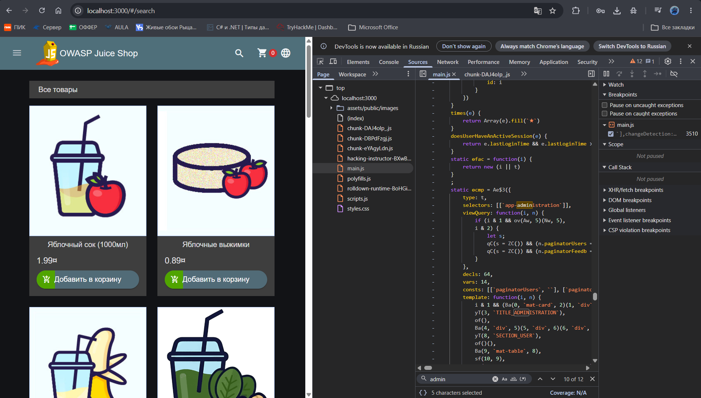
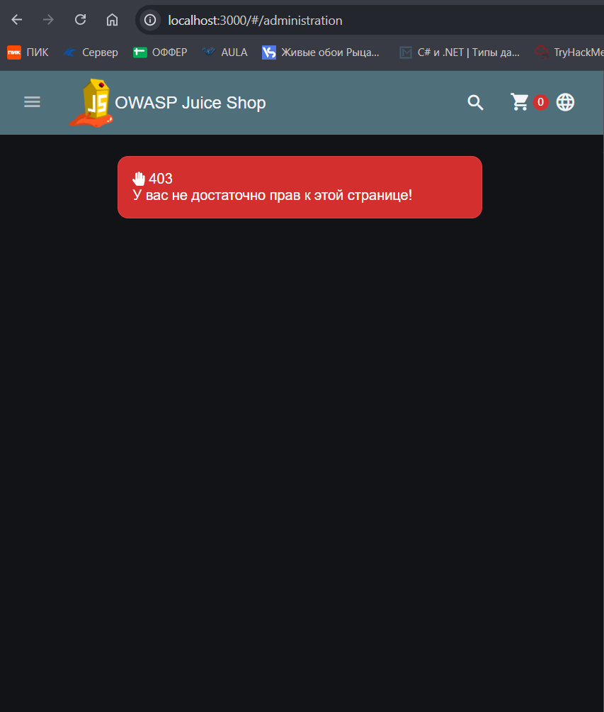

## Кейс №1: Обнаружение скрытой панели администратора (Vertical BAC)

### 📋 Краткая информация
* **Уязвимость:** A01:2021 - Broken Access Control (Information Disclosure + Vertical BAC)
* **Уровень риска:** High (при успешной эскалации привилегий)
* **Цель:** Получить несанкционированный доступ к административному функционалу веб-приложения.

---

### 🔍 Этап 1: Разведка и анализ клиентского кода (Information Disclosure)
Разработчики приложения попытались реализовать «безопасность за счет неизвестности» (Security through Obscurity): ссылка на панель администратора была скрыта из пользовательского интерфейса главного меню, однако логика и компоненты остались в клиентском коде.

**Шаги для обнаружения:**
1. Открыть приложение **OWASP Juice Shop** (`http://localhost:3000`).
2. Запустить инструменты разработчика в браузере (**F12**) и перейти на вкладку **Sources** (Источники).
3. Используя поиск по скомпилированным JavaScript-файлам (`Ctrl + F`), выполнить поиск ключевых слов, связанных с административной панелью (например, `admin`, `app-administration`).
4. В результате анализа кода был обнаружен Angular-компонент `app-administration` и базовые роуты эндпоинтов:
   ```javascript
   host = this.hostServer + `/rest/admin`;

На основе структуры роутера был вычислен скрытый путь административной панели: /#/administration.

### 🛑 Этап 2: Проверка контроля доступа (Broken Access Control)

При попытке прямого перехода по обнаруженному адресу бэкенд-приложение заблокировало доступ.

Запрос: GET /#/administration (или обращение к эндпоинтам /rest/admin/...)

Ответ сервера: 403 Forbidden (Недостаточно прав / Доступ запрещен)

Вывод по безопасности:
Фронтенд пытался скрыть функционал, а бэкенд корректно проверяет наличие прав администратора, возвращая код ошибки 403. Сама по себе эта ошибка подтверждает наличие защиты, однако факт раскрытия структуры роутов в клиентском JS-коде позволяет злоумышленнику точно знать цель для дальнейших атак (например, поиска уязвимостей повышения привилегий Privilege Escalation).

### Этап 3: Повышение привилегий (Privilege Escalation)

Для проверки формы аутентификации (/#/login) на устойчивость к синтаксическим инъекциям в поле Email был передан спецсимвол ' (одиночная кавычка).

Приложение вернуло статус ошибки с сообщением [object Object]. Следовательно, Бэкенд не выполняет фильтрацию и экранирование входных данных, передавая возникшее синтаксическое исключение СУБД на сторону клиента без корректной обработки.

Из-за отсутствия параметризации SQL-запросов на стороне сервера был сформирован контекстный пейлоад для нейролизации проверки пароля:
```text
Email: ' or 1=1--
Password: '--
```

Механика работы заключается в том, что введенная строка разорвала оригинальную структуру SQL-запроса, добавила всегда истинное логическое условие (OR 1=1) и отсекла проверку пароля символами комментария (--). СУБД вернула первую запись из таблицы пользователей, которой в системе является суперадминистратор (admin@juice-sh.op).

После отправки запроса бэкенд сгенерировал сессионный токен с административными привилегиями. В профиле отобразилась учетная запись admin@juice-sh.op, а повторный переход по адресу /#/administration завершился успешной загрузкой интерфейса.

### 📸 Доказательства (Screenshots)

**1. Обнаружение компонента админки в клиентском JS:**


**2. Получение ошибки 403 при попытке доступа:**


**3. Обнаружение необработанного исключения СУБД:**


**4. Внедрение пейлоада SQL-инъекции в форму входа:**


**5. Успешный вход под учетной записью администратора:**

